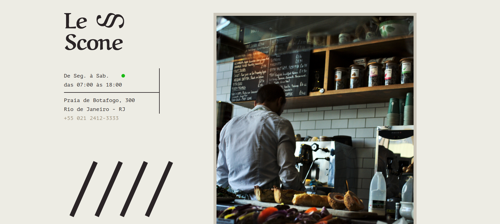

<p align="center">
   
</p>
<h1 align="center">
    
</h1>

<h4 align="center"> 
	🚧  CSS com SASS 🚧
</h4>
<p align="center">Deployed <a href="https://marcelo-rafael.github.io/lescone/">here</a>.</p>

<p align="center">
 <a href="#-sobre-o-projeto">Sobre</a> •
 <a href="#-como-executar-o-projeto">Como executar</a> • 
 <a href="#-tecnologias">Tecnologias</a> • 
 <a href="#-autor">Autor</a> • 
 <a href="#user-content--licença">Licença</a>
</p>


## 💻 Sobre o projeto

Projeto prático Le Scone feito com Pre-Processador SASS através do curso de CSS com SASS da [Origamid](https://www.origamid.com/curso/css-com-sass).

---


## 🚀 Como executar o projeto

Este projeto é feito em uma parte:

1. Frontend (projeto-lescone folder)


#### 🧭 Rodando a aplicação web

```bash

# Clone este repositório
$ git clone https://github.com/marcelo-rafael/bootstrap-brafe-1

# Acesse a pasta do projeto no seu terminal/cmd
$ cd projeto-lescone


```

---


## 🛠 Tecnologias

As seguintes ferramentas foram usadas na construção do projeto:

-   **[sass](https://sass-lang.com/)**

---

## 💪 Como contribuir para o projeto

1. Faça um **fork** do projeto.
2. Crie uma nova branch com as suas alterações: `git checkout -b my-feature`
3. Salve as alterações e crie uma mensagem de commit contando o que você fez: `git commit -m "feature: My new feature"`
4. Envie as suas alterações: `git push origin my-feature`

---

## Autor


[](https://www.linkedin.com/in/marcelo-rafael-gonçalves/) 
[](mailto:marcelo.rafael.goncalves@gmail.com)

---

## 📝 Licença

Este projeto esta sobe a licença [MIT](./LICENSE).


Feito com ❤️ por Marcelo Rafael Gonçalves 👋🏽 [Entre em contato!](https://www.linkedin.com/in/marcelo-rafael-gonçalves/)

